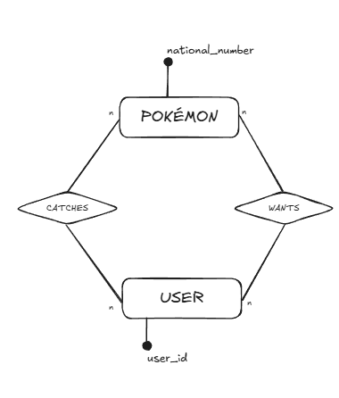
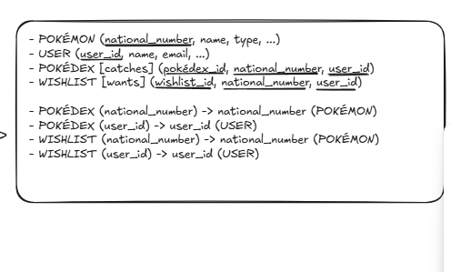

POKEDEX MANAGER

This project requires a ".env" file, so after cloning the repository, create a new file in the project: .env

Create an empty database with PostgreSQL

In the file, create variables "URL_DB", "USER_DB" and "PWD_DB", whose values are your database url, username and password (don't use quotes or commas!!! just the name of the variable = its value)

In .env, also define variable JWT_SECRET

Execute code

If any error occurs, consider realoding the project: Right-click on pom.xml>Maven>Reload project

PROJECT STRUCTURE

Project uses MVC pattern:

* Model: Class for every database table (variables, getter, setter, contructors).
* DAO: Istruction for DB connection and DB interaction methods.
* Service: In the project, this layer is purely to pass through the methods to the next layer.
* Controller: This layer "communicates" with front-end, providing routes for the front-end to fetch.
* Utility.Database: contains class DatabaseConnection, which provides one unique connection to DB via Singleton Design Pattern.
* Middleware: containes class AuthMiddleware, which provides method to protect routes from unauthenticated access and method to retrve id from token.
* Main: declaration and inizialization of "app" and controllers. Here is where to run project.
* Resources.db:
  * DDL (Data Definition Language): "create_tables.sql" that contains table creation queries.
  * DML (Data Manipulation Language): "insert_data.sql" that contains data insert queries.

DATABASE STRUCTURE

